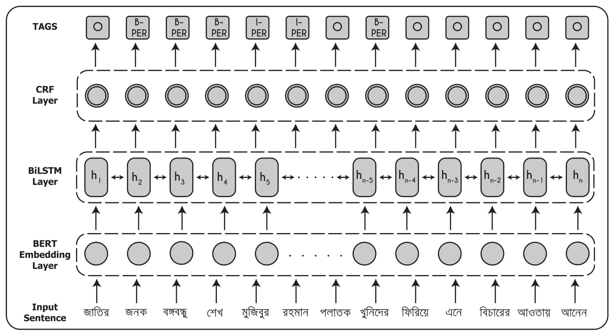

# BANNER
Pytorch implementation for paper [BANNER: A Cost-Sensitive Contextualized Model for Bangla Named Entity Recognition](https://ieeexplore.ieee.org/iel7/6287639/8948470/09044317.pdf) (published in IEEE Access) by Imranul Ashrafi, Muntasir Mohammad, Arani Shawkat Mauree, Galib Md. Azraf Nijhum, Redwanul Karim, Nabeel Mohammed and Sifat Momen.



## Getting Started
### Installing
- Install PyTorch and dependencies from https://pytorch.org.
- Install PyTorch Pretrained BERT from https://pypi.org/project/pytorch-pretrained-bert/

### Training
- Download dataset file `Bangla-NER-Splitted-Dataset.json` from https://github.com/MISabic/NER-Bangla-Dataset and place the file in the `data` folder.
- Run the following command:
```bash
python run.py
```

### Inference
- For using our pretrained model, download `banner_model.pt` from https://drive.google.com/file/d/1LtE0By2_cHXoHP0is0l0DVwfXIHBHXEV/view?usp=sharing 
- Place the model file in the `models` folder.
- Run the following command with example sentence:
```bash
python inference.py --sent 'শেখ মুজিবুর রহমান ফরিদপুর জেলার গোপালগঞ্জ মহকুমার টুঙ্গীপাড়া গ্রামে ১৯২০ সালের ১৭ মার্চ জন্মগ্রহণ করেন'
```

### Citing BANNER
If you find BANNER useful in your research, please consider citing:

```
@article{ashrafi2020banner,
  title={BANNER: A Cost-Sensitive Contextualized Model For Bangla Named Entity Recognition},
  author={Ashrafi, Imranul and Mohammad, Muntasir and Mauree, Arani Shawkat and Nijhum, Galib Md Azraf and Karim, Redwanul and Mohammed, Nabeel and Momen, Sifat},
  journal={IEEE Access},
  year={2020},
  publisher={IEEE}
}
```
